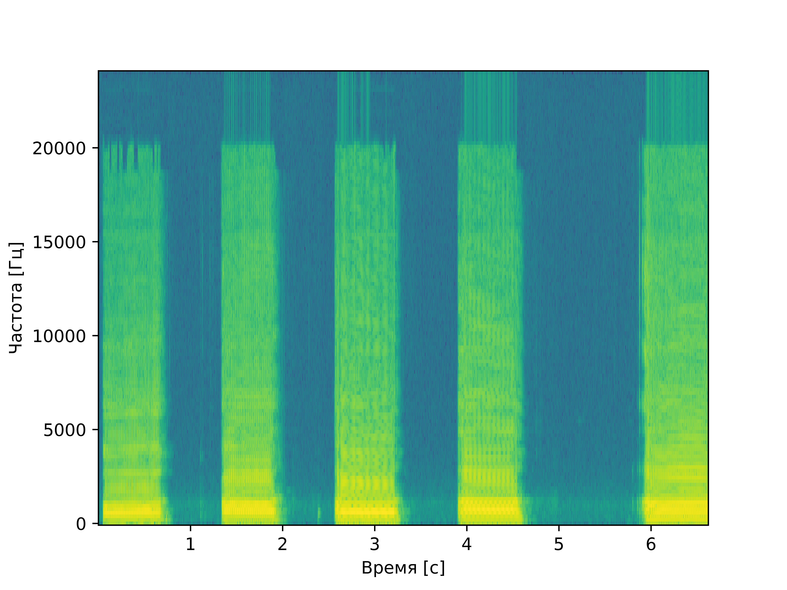
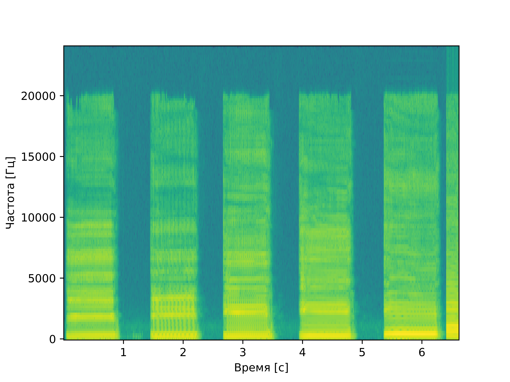
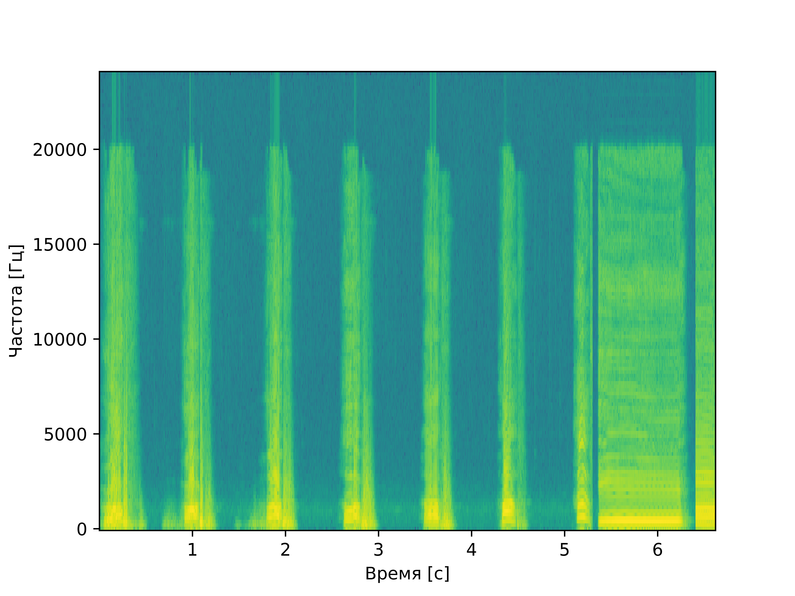

# laba10
# Лабораторная работа №10. Обработка голоса
Лабораторная работа выполнялась для записи звуков "А" и "И" мужским голосом, а также для имитации собачьего лая.
Построены спектрограммы записи названных звуков и приведен их анализ: 
- Определение примерных минимальной и максимальной частот голоса
- Поиск основного тона
- Поиск самых сильных формант

## Спектрограмма записи звука "А" по наростающей

### Анализ
**Основной тон: примерно 86 Гц** 

**Форманты:** форманта **FI** находится на частоте примерно 344 Гц, **FII** на частоте примерно 602 Гц,
**FIII** на частоте 861 Гц, **FIV** 1119 Гц

**Максимальная частоста:** 6546 Гц

## Спектрограмма записи звука "И" по наростающей

### Анализ
**Основной тон: примерно 86 Гц**

**Форманты:** форманта **FI** находится на частоте примерно 86 Гц, **FII** на частоте примерно 602 Гц,
**FIII** на частоте 861 Гц, **FIV** 1119 Гц

**Максимальная частоста:** 5254 Гц

## Спектрограмма записи лая

**Основной тон: примерно 86 Гц** 

**Форманты:** форманта **FI** находится на частоте примерно 344 Гц, **FII** на частоте примерно 602 Гц,
**FIII** на частоте 861 Гц, **FIV** 1119 Гц

**Максимальная частоста:** 5684 Гц
