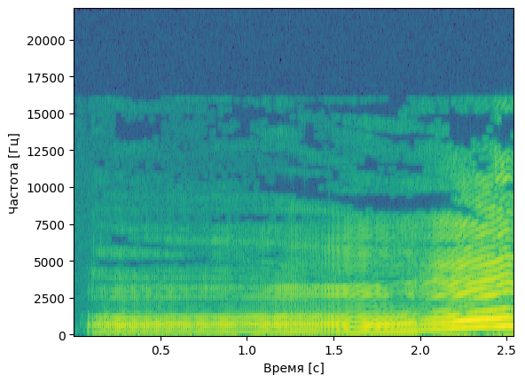
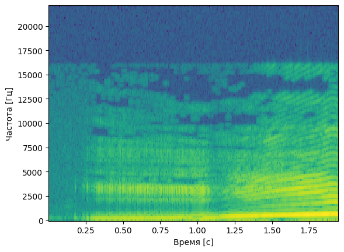
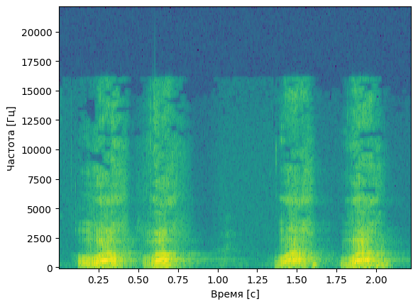

# laba10
# Лабораторная работа №10. Обработка голоса
Лабораторная работа выполнялась для записи звуков "А" и "И" мужским голосом, а также для имитации собачьего лая.
Построены спектрограммы записи названных звуков и приведен их анализ: 
- Определение примерных минимальной и максимальной частот голоса
- Поиск основного тона
- Поиск самых сильных формант

## Спектрограмма записи звука "А" по наростающей

### Анализ
**Основной тон: примерно 172 Гц** 

**Форманты:** форманта **FI** находится на частоте примерно 1724 Гц, **FII** на частоте примерно 689 Гц,
**FIII** на частоте 1205 Гц

**Максимальная частоста:** 6373 Гц

## Спектрограмма записи звука "И" по наростающей

### Анализ
**Основной тон: примерно 172 Гц**

**Форманты:** форманта **FI** находится на частоте примерно 172 Гц, **FII** на частоте примерно 689 Гц,
**FIII** на частоте 3273 Гц

**Максимальная частоста:** 4823 Гц

## Спектрограмма записи лая

**Основной тон: примерно 172 Гц** 

**Форманты:** форманта **FI** находится на частоте примерно 172 Гц, **FII** на частоте примерно 689 Гц,
**FIII** на частоте 1205 Гц

**Максимальная частоста:** 5857 Гц

